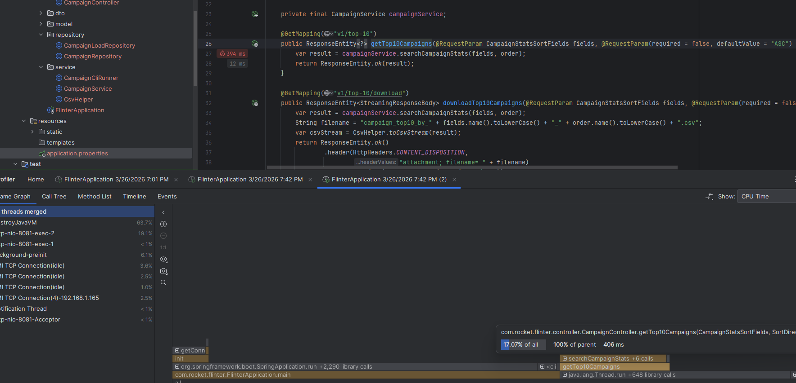

# 📊 Top 10 CPA & CTR Analyzer

A fast and lightweight Java application that extracts **Top 10 CPA** and **Top 10 CTR** results from large datasets efficiently.

Pre-generated sample outputs are available at:

```
src/resources/static
```

---

# 🚀 Features

✅ Supports **Local execution**
✅ Supports **Docker execution**
✅ Supports **Docker Compose execution**
✅ Run via **CLI**
✅ Run via **REST API**
✅ Run via **Unit Tests**
✅ Multiple aggregation strategies for performance optimization
✅ Efficient memory usage and fast processing time

---

# 📦 Build Project (Local)

Run:

```
./gradlew clean build
```

This generates:

```
build/libs/app.jar
```

---

# 🖥️ Run via CLI (Local)

## Get Top 10 CTR

```
java -jar build/libs/app.jar \
--file "your_absolute_path_file" \
--top-ctr \
--output result_top_ctr.csv
```

## Get Top 10 CPA

```
java -jar build/libs/app.jar \
--file "your_absolute_path_file" \
--top-cpa \
--output result_top_cpa.csv
```

Output files will be generated in your selected location.

---

# 🐳 Run via Docker

Build image:

```
docker build -t campaign .
```

Run container:

```
docker run campaign
```

---

# 🐳 Run via Docker Compose

```
docker compose up --build
```

---

# 🔍 Query & Aggregation Strategies

This project supports **two optimized processing approaches**:

## 1️⃣ DuckDB Query Engine

Uses DuckDB’s high-performance columnar execution engine:

* Reads only required columns
* Avoids loading entire dataset into memory
* Executes fast analytical queries
* Ideal for large-scale datasets

## 2️⃣ Streaming + Cache Strategy

Alternative optimized workflow:

* Streams file line-by-line
* Processes data in a single pass
* Caches intermediate aggregation results
* Enables extremely fast repeated queries

---

# 📚 Dependencies

All libraries used in this project are listed here:

```
build.gradle
```

Key technologies include:

* DuckDB
* Gradle
* Java CLI execution support
* Docker
* Docker Compose

---

# 📈 Performance Metrics

Benchmark results (Top 10 CPA / CTR search):

| Metric            | Result     |
| ----------------- | ---------- |
| Processing Time   | **691 ms** |
| Peak Memory Usage | **39 MB**  |
| Peak CPU Usage    | **26%**    |

Designed for **speed + low resource consumption** ⚡

---

# 🧪 Testing Options

You can validate functionality using:

* CLI execution
* REST API requests
* Unit tests

Choose whichever workflow fits your development environment best.

---

# 📁 Sample Output Location

Example result files:

```
src/resources/static/result_top_ctr.csv
src/resources/static/result_top_cpa.csv
```

---

# 🧑‍💻 Developer Notes

This project demonstrates:

* Efficient large-file processing
* Columnar analytics using DuckDB
* Streaming-based aggregation
* Cache-assisted querying
* Multi-environment execution support

